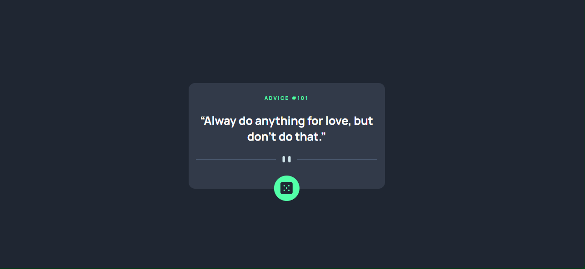

# Frontend Mentor - Advice generator app solution

This is a solution to the [Advice generator app challenge on Frontend Mentor](https://www.frontendmentor.io/challenges/advice-generator-app-QdUG-13db). Frontend Mentor challenges help you improve your coding skills by building realistic projects.

## Table of contents

- [Overview](#overview)
  - [The challenge](#the-challenge)
  - [Screenshot](#screenshot)
  - [Links](#links)
- [My process](#my-process)
  - [Built with](#built-with)
  - [What I learned](#what-i-learned)
  - [Continued development](#continued-development)
  - [Useful resources](#useful-resources)
- [Author](#author)
- [Acknowledgments](#acknowledgments)

## Overview

### The challenge

Users should be able to:

- View the optimal layout for the app depending on their device's screen size
- See hover states for all interactive elements on the page
- Generate a new piece of advice by clicking the dice icon

### Screenshot



### Links

- Solution URL: [Add solution URL here](https://adviceslip.vercel.app)
- Live Site URL: [https://adviceslip.vercel.app](https://adviceslip.vercel.app)

## My process

### Built with

- Semantic HTML5 markup
- CSS custom properties
- Flexbox
- CSS Grid
- [Vue.js](https://vuejs.org/) - JS library

### What I learned

Actually my first time learning Vue and using it for a project. I learnt some simple and basic stuff about view but still need alot more practice using it.

A cool thing I found ou was how they handle Class Bindings which made it really easy o have and update dynamic styles in your website.

Here I added a little extra feature to show the dice rotating while it is fetching more data.

```vue
<div class="dice-container" @click="fetchData">
    
</div>
```

### Continued development

So far ecerything is functional as I would like it, I would maybe work on cleaning up the code and make the responsive layout more natural.

### Useful resources

- [Vue JS Doccumentation ](https://vuejs.org) - made starting wih vue easy to use

## Author

- Website - [Add your name here](https://github.com/dylan-dot-c)
- Frontend Mentor - [@yourusername](https://www.frontendmentor.io/profile/dylan-dot-c)
